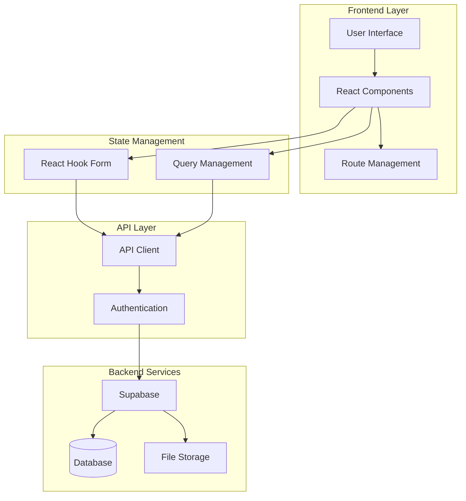
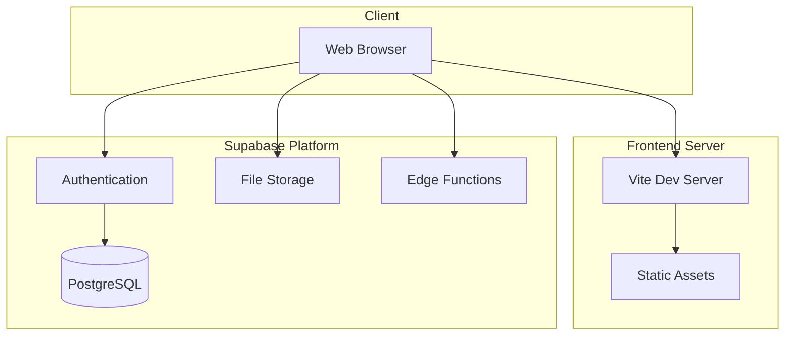
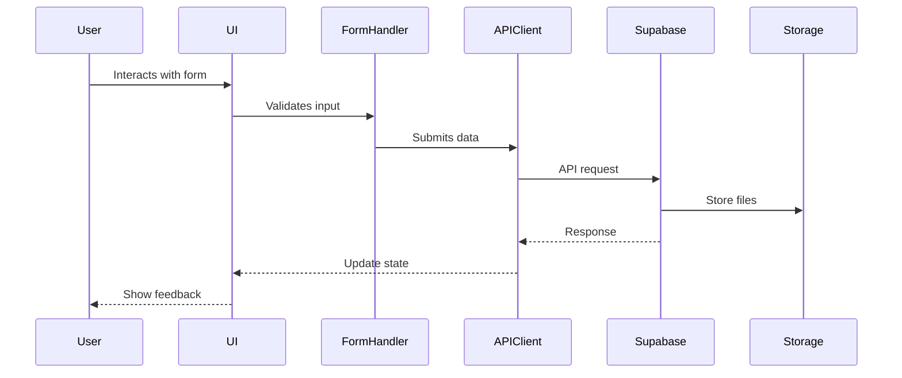
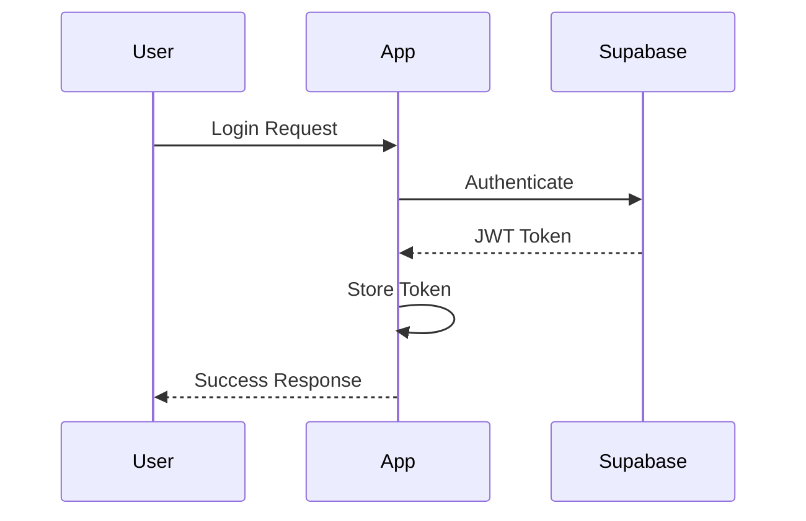

# Barangay Complaint Tracking System

```mermaid
classDiagram
direction BT
class admin_dashboard_view {
   bigint total_users
   bigint total_admins
   bigint total_lupon_members
   bigint total_citizens
   json user_growth_trends_last_12_months
   bigint total_complaints
   bigint pending_complaints
   bigint in_process_complaints
   bigint resolved_complaints
   bigint dismissed_complaints
   json complaint_trends_last_12_months
   numeric avg_resolution_time_days
   numeric sla_compliance_percentage
   json complaints_by_barangay
   json complaints_by_type
   json recent_complaints
   json users_by_province
   json active_users
}
class admin_report_view {
   uuid complaint_id
   text case_number
   text case_title
   text complaint_description
   complaint_status status
   timestamp with time zone date_filed
   timestamp with time zone resolution_date
   timestamp with time zone created_at
   timestamp with time zone updated_at
   text complaint_type
   text barangay_name
   text municipality_name
   text filed_by
   json participants
   json documents
   json history
}
class barangays {
   text name
   bigint municipality_id
   uuid id
}
class citizen_dashboard_view {
   uuid user_id
   text first_name
   text last_name
   bigint total_complaints
   bigint pending_complaints
   bigint in_process_complaints
   bigint resolved_complaints
   bigint dismissed_complaints
   numeric avg_resolution_time_days
   json top_complaint_types
   json complaint_trends_last_12_months
   json recent_complaints
}
class node11 {
   uuid complaint_id
   text file_name
   text file_path
   timestamp with time zone uploaded_at
   uuid uploaded_by
   timestamp with time zone created_at
   uuid document_id
}
class node3 {
   uuid complaint_id
   text action_taken
   uuid action_by
   timestamp with time zone action_date
   timestamp with time zone created_at
   uuid history_id
}
class node18 {
   uuid complaint_id
   uuid added_by
   uuid person_id
   text role
   timestamp with time zone created_at
   timestamp with time zone updated_at
   uuid participant_id
}
class complaint_types {
   text description
   uuid complaint_type_id
}
class complaint_view {
   uuid complaint_id
   text case_number
   text complaint_description
   complaint_status status
   timestamp with time zone date_filed
   timestamp with time zone resolution_date
   text case_title
   text barangay_name
   text complaint_type
   json participants
   json history
   json documents
}
class node24 {
   text case_number
   uuid barangay_id
   text description
   complaint_status status
   timestamp with time zone date_filed
   timestamp with time zone resolution_date
   timestamp with time zone created_at
   timestamp with time zone updated_at
   text case_title
   uuid complaint_type_id
   uuid filed_by
   uuid id
}
class lupon_member_dashboard_view {
   uuid lupon_member_id
   text first_name
   text last_name
   text barangay_name
   bigint total_complaints
   bigint pending_complaints
   bigint in_process_complaints
   bigint resolved_complaints
   bigint dismissed_complaints
   numeric avg_resolution_time_days
   json complaint_trends_last_12_months
   json top_complaint_types
   json recent_complaints
   json participants_in_recent_complaints
}
class node2 {
   uuid user_id
   uuid barangay_id
   text position
   timestamp with time zone created_at
   timestamp with time zone updated_at
   uuid lupon_member_id
}
class lupon_report_view {
   uuid complaint_id
   text case_number
   text case_title
   text complaint_description
   complaint_status status
   timestamp with time zone date_filed
   timestamp with time zone resolution_date
   timestamp with time zone created_at
   timestamp with time zone updated_at
   text complaint_type
   text barangay_name
   text filed_by
   json participants
   json documents
   json history
}
class municipalities {
   text name
   bigint province_id
   bigint municipality_id
}
class node22 {
   text first_name
   text last_name
   text address
   text contact_info
   timestamp with time zone created_at
   timestamp with time zone updated_at
   uuid person_id
}
class provinces {
   text name
   bigint province_id
}
class report_lupon_complaint_summary {
   uuid lupon_member_id
   text first_name
   text last_name
   text barangay_name
   bigint total_complaints
   bigint pending_complaints
   bigint in_process_complaints
   bigint resolved_complaints
   bigint dismissed_complaints
   numeric avg_resolution_time_days
   json complaint_trends_last_12_months
   json top_complaint_types
}
class report_lupon_complaint_trends {
   text month
   bigint complaint_count
}
class report_lupon_documentation {
   uuid complaint_id
   uuid document_id
   text file_name
   text file_path
   timestamp with time zone uploaded_at
   uuid uploaded_by
}
class report_lupon_member_activity {
   uuid lupon_member_id
   text first_name
   text last_name
   bigint complaints_handled
   bigint resolved_complaints
   numeric avg_resolution_time_days
}
class report_lupon_member_complaints {
   uuid complaint_id
   text case_number
   text case_title
   text complaint_description
   complaint_status status
   timestamp with time zone date_filed
   timestamp with time zone resolution_date
   timestamp with time zone created_at
   timestamp with time zone updated_at
   text complaint_type
   text barangay_name
   text filed_by
   json participants
   json documents
   json history
}
class report_lupon_participant_details {
   uuid complaint_id
   uuid participant_id
   text participant_name
   text role
   text contact_info
}
class report_lupon_resolution_times {
   uuid complaint_id
   text case_number
   text case_title
   timestamp with time zone date_filed
   timestamp with time zone resolution_date
   numeric resolution_time_days
}
class user_profile {
   uuid user_id
   text first_name
   text middle_name
   text last_name
   text address
   varchar(255) email
   text barangay_name
   text municipality_name
   text province_name
   text role_name
   timestamp with time zone created_at
   timestamp with time zone updated_at
}
class user_roles {
   text role_name
   bigint role_id
}
class users {
   text first_name
   bigint role_id
   timestamp with time zone created_at
   timestamp with time zone updated_at
   uuid barangay_id
   text address
   text middle_name
   text last_name
   uuid user_id
}

admin_report_view  -->  node24 : complaint_id
barangays  -->  municipalities : municipality_id
node11  -->  node24 : complaint_id
node3  -->  node24 : complaint_id
node18  -->  node24 : complaint_id
node18  -->  node22 : person_id
complaint_view  -->  node24 : complaint_id
node24  -->  barangays : barangay_id
node24  -->  complaint_types : complaint_type_id
node2  -->  barangays : barangay_id
node2  -->  users : user_id
lupon_report_view  -->  node24 : complaint_id
municipalities  -->  provinces : province_id
report_lupon_documentation  -->  node24 : complaint_id
report_lupon_member_complaints  -->  node24 : complaint_id
report_lupon_participant_details  -->  node24 : complaint_id
report_lupon_resolution_times  -->  node24 : complaint_id
users  -->  barangays : barangay_id
users  -->  user_roles : role_id
```




## 1. **Introduction**
### 1.1 Project Overview
- **Project Name**: Complain-Ant (Barangay Complaint Tracking System)
- **Target Audience**: 
  - Citizens filing complaints
  - Lupon Members (complaint handlers)
  - System Administrators
- **Scope**: 
  - Complaint management system
  - User authentication and authorization
  - Document management
  - Status tracking and history
  - Reporting and analytics

### 1.2 Objectives
- **Primary Goals**:
  - Streamline the complaint filing process
  - Provide transparent tracking of complaint status
  - Enable efficient complaint management by lupon members
  - Maintain secure and organized documentation
  - Generate insights through reporting

### 1.3 Stakeholders
- Citizens (Complainants and Respondents)
- Lupon Members
- Barangay Officials
- System Administrators
- Development Team

## 2. **System Architecture**

### 2.1 High-Level Architecture


### 2.2 Logical Architecture
- **Presentation Layer**:
  - React Components (UI/UX)
  - Shadcn/UI Components
  - Motion Components
  - Form Components

- **Application Layer**:
  - Route Management
  - State Management
  - Form Handling
  - Data Validation

- **Service Layer**:
  - API Integration
  - Authentication
  - File Management
  - Data Transformation

### 2.3 Physical Architecture


## 3. **System Design**

### 3.1 Functional Design
- **Modules**:
  - Authentication Module
  - Complaint Management Module
  - Document Management Module
  - User Management Module
  - Reporting Module

- **Features**: [Detailed in FEATURES.md]
  - User Registration and Authentication
  - Profile Management
  - Complaint Filing and Tracking
  - Document Upload and Management
  - Status Updates and History
  - Administrative Controls

### 3.2 Non-Functional Requirements
- **Performance**:
  - Page load time < 2 seconds
  - API response time < 500ms
  - Smooth animations (60fps)

- **Security**:
  - Role-based access control
  - Secure file uploads
  - Data encryption
  - Session management

- **Usability**:
  - Responsive design
  - Accessible UI components
  - Intuitive navigation
  - Form validation feedback

### 3.3 Data Flow


### 3.4 API Design
- **Authentication Endpoints**:
```typescript
interface AuthEndpoints {
  login: POST /auth/login
  register: POST /auth/register
  logout: POST /auth/logout
  refreshToken: POST /auth/refresh
}
```

- **Complaint Endpoints**:
```typescript
interface ComplaintEndpoints {
  create: POST /complaints
  update: PUT /complaints/:id
  delete: DELETE /complaints/:id
  getList: GET /complaints
  getOne: GET /complaints/:id
  uploadDocument: POST /complaints/:id/documents
  updateStatus: PUT /complaints/:id/status
  addHistory: POST /complaints/:id/history
}
```

- **Error Handling**:
```typescript
interface APIError {
  status: number;
  message: string;
  details?: Record<string, unknown>;
}
```

### 3.5 Database Design
[Schema details from README.md included here]

## 4. **Technologies and Dependencies**

### 4.1 Programming Languages and Frameworks
- **TypeScript**: v5.4.2
  - Strong typing
  - Enhanced IDE support
  - Better code maintainability

- **React**: v18.0.0
  - Component-based architecture
  - Virtual DOM
  - Hooks-based state management

- **Vite**: v4.3.1
  - Fast development server
  - Efficient build process
  - Modern module system

### 4.2 Tools and Libraries
- **UI Components**:
  ```json
  {
    "@radix-ui/react-*": "^1.x",
    "class-variance-authority": "^0.7.0",
    "clsx": "^2.1.1",
    "tailwind-merge": "^2.5.2"
  }
  ```

- **Form Handling**:
  ```json
  {
    "@hookform/resolvers": "^3.9.0",
    "react-hook-form": "^7.53.0",
    "zod": "^3.23.8"
  }
  ```

- **Data Management**:
  ```json
  {
    "@refinedev/core": "^4.47.1",
    "@refinedev/supabase": "^5.7.4",
    "@supabase/supabase-js": "^2.45.4"
  }
  ```

### 4.3 Infrastructure
- **Hosting Environment**: 
  - Development: Vite Dev Server
  - Production: Docker container with Node.js

- **Database**: 
  - Supabase PostgreSQL

- **File Storage**:
  - Supabase Storage

### 4.4 Third-Party Services
- **Supabase**:
  - Authentication
  - Database
  - Storage
  - Real-time subscriptions

- **Development Tools**:
  ```json
  {
    "@biomejs/biome": "1.9.2",
    "typescript": "^5.4.2",
    "tailwindcss": "^3.4.13"
  }
  ```

## 5. **Implementation Guidelines**

### 5.1 Coding Standards
- **Component Structure**:
```typescript
// Component naming
interface ComponentNameProps {
  // Props interface
}

export function ComponentName({ prop1, prop2 }: ComponentNameProps) {
  // Implementation
}
```

- **Styling**:
```typescript
// Utility function for class names
import { cn } from "@/lib/utils"

const className = cn(
  "base-styles",
  conditional && "conditional-styles",
  props.className
)
```

### 5.2 Version Control
- **Branch Strategy**:
  - `main`: Production-ready code
  - `develop`: Integration branch
  - `feature/*`: New features
  - `bugfix/*`: Bug fixes
  - `release/*`: Release preparation

### 5.3 Testing Strategy
- **Unit Tests**:
  - Component testing
  - Utility function testing
  - Form validation testing

- **Integration Tests**:
  - API integration testing
  - Authentication flow testing
  - Form submission testing

### 5.4 Deployment Guidelines
```dockerfile
# Production deployment
FROM refinedev/node:18 AS base
# ... [Dockerfile contents as shown in codebase]
```

## 6. **Operational Guidelines**

### 6.1 Monitoring and Logging
- **Client-side Error Tracking**:
```typescript
window.onerror = (message, source, lineno, colno, error) => {
  // Log to monitoring service
}
```

### 6.2 Backup and Recovery
- **Data Backup**:
  - Supabase automated backups
  - Document storage redundancy
  - Version control for code

### 6.3 Maintenance Plan
- Weekly dependency updates
- Monthly security audits
- Quarterly performance reviews

## 7. **Security Guidelines**

### 7.1 Data Security
```typescript
// Example of secure data handling
const secureDataTransform = (data: SensitiveData): SafeData => {
  // Remove sensitive fields
  const { password, ...safeData } = data;
  return safeData;
}
```

### 7.2 Application Security
- **Authentication Flow**:


### 7.3 Access Control
```typescript
// Role-based access control
const roles = {
  ADMIN: 'admin',
  LUPON: 'lupon_member',
  CITIZEN: 'citizen'
} as const;

type Role = typeof roles[keyof typeof roles];

interface AccessControl {
  role: Role;
  permissions: string[];
}
```

## 8. **Appendices**

### 8.1 Glossary
- **Lupon**: Barangay justice system member
- **Complainant**: Person filing the complaint
- **Respondent**: Person against whom the complaint is filed

### 8.2 References
- React Documentation
- Supabase Documentation
- Vite Documentation
- TailwindCSS Documentation

Every table here plays a specific role, and they all link together in practical ways to make complaint management as smooth as possible. **Citizens** file complaints, **lupon members** work on them, and **admins** keep everything organized. The `complaints` table is central, but it’s everything around it—the documents, the history, the participants—that paints the full picture for resolving issues efficiently.

### 1. Table Descriptions and Purposes

| Table Name               | Description                                                                                           | Purpose                                                                                               |
|--------------------------|-------------------------------------------------------------------------------------------------------|-------------------------------------------------------------------------------------------------------|
| **barangays**            | Holds data about each barangay.                                                                      | Tracks barangay names, their municipality, and province. This links to complaints and lupon members.  |
| **citizens**             | Stores basic citizen info like email and phone.                                                      | Acts as the citizen identity in the system. Every citizen starts here—the baseline data for complaints.|
| **citizen_profiles**     | More detailed citizen info like full name and address.                                               | Extends the base info in `citizens` with specific details like house number and street.               |
| **lupon_members**        | Details about members of the Lupon Tagapamayapa.                                                     | Lists who’s part of the lupon for each barangay, including their contact info and role.             |
| **complaints**           | Central table for all complaints filed by citizens.                                                  | Stores complaint details, like case number, type, description, and current status.                    |
| **complaint_documents**  | Holds documents related to complaints.                                                               | Links relevant files—think evidence, supporting docs—to the complaints.                          |
| **complaint_history**    | Tracks every action taken on a complaint.                                                            | Maintains an audit trail: who did what and when, for a complete picture of the complaint's progress.  |
| **people**               | Stores info about individuals tied to complaints.                                                    | Handles participants who aren't registered citizens but are still involved, like respondents.         |
| **complaint_participants** | Associates people with complaints, specifying their role (e.g., complainant, respondent).          | Tracks each person’s role within a complaint—who’s the complainant, who’s the respondent, etc.      |
| **user_roles**           | Stores different roles, like admin or lupon_member.                                                  | Controls permissions across the system. Defines what each role can access or modify.                 |
| **users**                | General user data, including role assignments.                                                       | Manages system users. Links each person to their corresponding role, giving them appropriate permissions. |

### 2. User Stories

To give you a sense of how these tables work together, here are some user stories that show real interactions:

#### **User Story 1: Citizen Files a Complaint**
**As a citizen, I want to file a complaint with my barangay so that I can address a neighborhood issue.**

- A citizen signs up and logs in to the system. Their basic details are stored in the `citizens` table, while more detailed info (like their address) is saved in `citizen_profiles`.
- They then navigate to the "File a Complaint" section. Here, they enter their complaint details—say, an issue with noise from a neighbor.
- This information is saved to the `complaints` table and associated with their barangay. If they need to add evidence, like photos or other documents, those files go into `complaint_documents`, linked by the `complaint_id`.

#### **User Story 2: Citizen Tracks Complaint Status**
**As a citizen, I want to track my complaint so I know what's happening.**

- The citizen logs back in after a few days to check the status of their complaint.
- They visit "My Complaints," where they see the current status—maybe still "Pending" or now "Resolved." This status is tracked in the `complaints` table.
- Any updates made by lupon members are logged in `complaint_history`. This way, the citizen knows exactly when updates or actions were taken and by whom.

#### **User Story 3: Lupon Member Updates Complaint**
**As a lupon member, I want to update the complaint status so the citizen knows we’re working on it.**

- A lupon member logs in and accesses the complaints linked to their barangay.
- They select a complaint, maybe one involving a dispute between two households, and change the status from "Pending" to "In Process." They can also add notes, which get logged in `complaint_history`.
- This ensures both transparency and accountability, as citizens can see the history of actions related to their complaint.

#### **User Story 4: Admin Adds a Lupon Member**
**As an admin, I want to add new lupon members so that we can handle more complaints.**

- An admin logs in and navigates to the lupon management section.
- They add a new lupon member, filling in the name, position, and the assigned barangay. This information goes into `lupon_members`.
- Now, the new lupon member can start managing complaints for their barangay.

#### **User Story 5: Citizen Adds More Documents**
**As a citizen, I want to add more documents to my complaint so that the officials have more context.**

- A citizen logs in, selects their existing complaint, and uploads an additional document—maybe a screenshot or another piece of evidence.
- This new document gets added to the `complaint_documents` table, linked to the specific complaint.
- Lupon members handling that complaint can immediately see the new document when they log in.

#### **User Story 6: Lupon Member Views Participants**
**As a lupon member, I want to see everyone involved in a complaint so I can ensure the right people are notified.**

- The lupon member views a complaint they are handling. They can see the full list of participants linked to it in `complaint_participants`.
- The system pulls data from `people` and `citizens` to show more details on each participant—like whether they're a complainant or a respondent, and their contact details.

# Feature Guidelines

This document has been updated to reflect the implemented views in the complaint management system. It outlines the features available to each user type: **Admin**, **Lupon Member**, and **Citizen**. Each feature includes a description, the views that support it, what it contains, user actions, and its purpose.

---

## **Citizen Features**

### 1. User Registration and Authentication

- **Routes**:
  - `POST /register`
  - `POST /login`
  - `POST /logout`

- **Description**: Allows citizens to create an account, log in, and log out of the system.

- **Contains**:
  - Registration form requiring email, phone number, full name, and address details (purok, street, block number, house number).
  - Login form for entering email and password.
  - Logout functionality to securely end the session.

- **User Actions**:
  - **Register**: Submit personal and contact information to create an account.
  - **Login**: Enter credentials to access the system.
  - **Logout**: Safely exit the system.

- **Purpose**: To establish a secure and unique identity for each citizen, enabling personalized access to system features.

---

### 2. Profile Management

- **Routes**:
  - `GET /profile`
  - `PUT /profile/edit`

- **Views**:
  - `vw_citizen_profile`

- **Description**: Enables citizens to view and update their personal profile information.

- **Contains**:
  - Display of current profile information, including full name, contact details, and address, as provided by `vw_citizen_profile`.
  - Edit form for updating profile information.

- **User Actions**:
  - **View Profile**: See current personal information.
  - **Edit Profile**: Update personal details as needed.

- **Purpose**: To maintain accurate and up-to-date personal information for effective communication and record-keeping.

---

### 3. File a Complaint

- **Routes**:
  - `GET /complaints/new`
  - `POST /complaints`

- **Views**:
  - `vw_citizen_barangays`

- **Description**: Allows citizens to file new complaints regarding issues in their barangay.

- **Contains**:
  - Complaint submission form requiring details like complaint type, description, and involved parties.
  - Option to select the barangay from a list provided by `vw_citizen_barangays`.
  - Ability to attach initial documents.

- **User Actions**:
  - **Fill Complaint Form**: Provide all necessary details about the complaint.
  - **Submit Complaint**: Officially file the complaint with the system.

- **Purpose**: To enable citizens to report issues formally, initiating the resolution process by the appropriate authorities.

---

### 4. Upload Complaint Documents

- **Routes**:
  - `GET /complaints/:complaint_id/documents/upload`
  - `POST /complaints/:complaint_id/documents`

- **Views**:
  - `vw_citizen_complaint_documents`

- **Description**: Allows citizens to upload and view supporting documents for their complaints.

- **Contains**:
  - Interface for selecting and uploading files (e.g., photos, videos, PDFs).
  - List of previously uploaded documents, accessible via `vw_citizen_complaint_documents`.

- **User Actions**:
  - **Select Files**: Choose files from their device to upload.
  - **Upload Documents**: Attach files to the specific complaint.
  - **View Documents**: Access uploaded documents associated with their complaints.

- **Purpose**: To provide additional evidence or information that supports the complaint, aiding in its resolution.

---

### 5. View Complaint Status

- **Routes**:
  - `GET /complaints`
  - `GET /complaints/:complaint_id`

- **Views**:
  - `vw_citizen_complaints`

- **Description**: Allows citizens to view a list of their complaints and check the status of each.

- **Contains**:
  - Summary list of all complaints filed by the citizen, as provided by `vw_citizen_complaints`.
  - Detailed view of individual complaints, including status updates.

- **User Actions**:
  - **View Complaint List**: See all submitted complaints at a glance.
  - **Check Status**: View current status (e.g., Pending, In Process, Resolved) of each complaint.
  - **View Details**: Access detailed information about a specific complaint.

- **Purpose**: To keep citizens informed about the progress and handling of their complaints.

---

### 6. View Complaint History

- **Routes**:
  - `GET /complaints/:complaint_id/history`

- **Views**:
  - `vw_citizen_complaint_history`

- **Description**: Provides a timeline of actions taken on the citizen's complaints.

- **Contains**:
  - Chronological list of all actions, updates, and notes added to the complaint, accessible via `vw_citizen_complaint_history`.
  - Details such as action date, description, and the lupon member responsible.

- **User Actions**:
  - **Review History**: Understand what actions have been taken and by whom.
  - **Stay Informed**: Keep track of the complaint's progress over time.

- **Purpose**: To ensure transparency and keep citizens updated on how their complaints are being addressed.

---

## **Lupon Member Features**

### 1. User Authentication

- **Routes**:
  - `POST /lupon/login`
  - `POST /lupon/logout`

- **Description**: Allows lupon members to securely access their accounts.

- **Contains**:
  - Login form for entering credentials (username and password).
  - Logout functionality.

- **User Actions**:
  - **Login**: Access the lupon dashboard and tools.
  - **Logout**: Securely exit the system after use.

- **Purpose**: To authenticate lupon members and grant them access to complaint management features.

---

### 2. View Assigned Complaints

- **Routes**:
  - `GET /lupon/complaints`
  - `GET /lupon/complaints/:complaint_id`

- **Views**:
  - `vw_lupon_complaints`

- **Description**: Allows lupon members to view complaints assigned to their barangay.

- **Contains**:
  - List of all complaints within their jurisdiction, provided by `vw_lupon_complaints`.
  - Filters for sorting by status, date filed, or complaint type.
  - Detailed view of individual complaints.

- **User Actions**:
  - **Browse Complaints**: See all complaints they are responsible for.
  - **View Details**: Access full information on a specific complaint.

- **Purpose**: To enable lupon members to manage and prioritize complaints effectively.

---

### 3. Update Complaint Status

- **Routes**:
  - `PUT /lupon/complaints/:complaint_id/status`

- **Description**: Allows lupon members to change the status of a complaint.

- **Contains**:
  - Interface for selecting new status (e.g., In Process, Resolved, Dismissed).
  - Option to add comments or notes explaining the status change.

- **User Actions**:
  - **Change Status**: Update the complaint's status to reflect its current state.
  - **Add Notes**: Provide context or details about the status update.

- **Purpose**: To keep the complaint's progress accurately reflected in the system for all stakeholders.

---

### 4. Add Complaint History Entry

- **Routes**:
  - `POST /lupon/complaints/:complaint_id/history`

- **Views**:
  - `vw_lupon_complaint_history`

- **Description**: Allows lupon members to document actions taken on a complaint.

- **Contains**:
  - Form for entering details about an action, including description and date.
  - Fields for specifying any next steps or required follow-ups.
  - Access to the complaint's history via `vw_lupon_complaint_history`.

- **User Actions**:
  - **Log Action**: Record any meetings, communications, or decisions made.
  - **Update History**: Keep the complaint's history comprehensive and up-to-date.

- **Purpose**: To maintain a complete record of all activities related to the complaint for accountability and reference.

---

### 5. Upload Complaint Documents

- **Routes**:
  - `GET /lupon/complaints/:complaint_id/documents/upload`
  - `POST /lupon/complaints/:complaint_id/documents`

- **Views**:
  - `vw_lupon_complaint_documents`

- **Description**: Allows lupon members to attach additional documents to a complaint.

- **Contains**:
  - Interface for uploading files such as official letters, notices, or evidence collected.
  - List of all documents associated with the complaint, accessible via `vw_lupon_complaint_documents`.

- **User Actions**:
  - **Select Files**: Choose documents to upload.
  - **Upload Documents**: Attach files to the complaint for record-keeping.
  - **View Documents**: Access documents associated with complaints.

- **Purpose**: To enrich the complaint record with official documents, aiding in resolution and future reference.

---

### 6. View Complaint Participants

- **Routes**:
  - `GET /lupon/complaints/:complaint_id/participants`

- **Views**:
  - `vw_lupon_complaint_participants`

- **Description**: Provides information about all individuals involved in a complaint.

- **Contains**:
  - List of participants with their roles (e.g., Complainant, Respondent), accessible via `vw_lupon_complaint_participants`.
  - Contact information and any relevant notes.

- **User Actions**:
  - **Review Participants**: Understand who is involved in the complaint.
  - **Access Contact Info**: Obtain necessary details to communicate with participants.

- **Purpose**: To ensure that all parties are identified and can be engaged appropriately during the resolution process.

---

## **Admin Features**

### 1. User Authentication

- **Routes**:
  - `POST /admin/login`
  - `POST /admin/logout`

- **Description**: Secures access to the administrative functions of the system.

- **Contains**:
  - Admin login form.
  - Logout functionality.

- **User Actions**:
  - **Login**: Access the admin dashboard and tools.
  - **Logout**: Securely exit the admin area.

- **Purpose**: To prevent unauthorized access to sensitive administrative features.

---

### 2. Manage Users

- **Routes**:
  - `GET /admin/users`
  - `GET /admin/users/:user_id`
  - `POST /admin/users`
  - `PUT /admin/users/:user_id`
  - `DELETE /admin/users/:user_id`

- **Views**:
  - `vw_admin_users`

- **Description**: Allows admins to oversee all user accounts in the system.

- **Contains**:
  - User list with search and filter capabilities, provided by `vw_admin_users`.
  - Detailed view of individual user profiles.
  - Forms for creating and editing users.
  - Options to assign roles and deactivate accounts.

- **User Actions**:
  - **View Users**: See all registered users.
  - **Add User**: Create new user accounts, including other admins and lupon members.
  - **Edit User**: Update user information and roles.
  - **Delete User**: Remove user accounts from the system.

- **Purpose**: To control access to the system and manage user permissions effectively.

---

### 3. Manage Lupon Members

- **Routes**:
  - `GET /admin/lupon_members`
  - `GET /admin/lupon_members/:lupon_id`
  - `POST /admin/lupon_members`
  - `PUT /admin/lupon_members/:lupon_id`
  - `DELETE /admin/lupon_members/:lupon_id`

- **Views**:
  - `vw_admin_lupon_members`

- **Description**: Allows admins to manage lupon members' records.

- **Contains**:
  - List of all lupon members, accessible via `vw_admin_lupon_members`.
  - Details such as name, position, contact info, and assigned barangay.
  - Forms for adding and editing lupon member information.

- **User Actions**:
  - **View Lupon Members**: See all lupon members in the system.
  - **Add Lupon Member**: Register new lupon members.
  - **Edit Lupon Member**: Update existing lupon member details.
  - **Delete Lupon Member**: Remove lupon members from the system.

- **Purpose**: To ensure the lupon member records are accurate and up-to-date for effective complaint handling.

---

### 4. Manage Locations (Barangays, Municipalities, Provinces)

- **Routes**:
  - `GET /admin/locations/barangays`
  - `POST /admin/locations/barangays`
  - `PUT /admin/locations/barangays/:id`
  - `DELETE /admin/locations/barangays/:id`
  - Similar routes for municipalities and provinces.

- **Views**:
  - `vw_admin_barangays`
  - `vw_admin_municipalities`
  - `vw_admin_provinces`

- **Description**: Allows admins to manage geographic entities within the system.

- **Contains**:
  - Lists of barangays (`vw_admin_barangays`), municipalities (`vw_admin_municipalities`), and provinces (`vw_admin_provinces`).
  - Forms for adding and editing location data.

- **User Actions**:
  - **View Locations**: See all geographic entries.
  - **Add Location**: Create new barangays, municipalities, or provinces.
  - **Edit Location**: Update names and associations.
  - **Delete Location**: Remove locations no longer in use.

- **Purpose**: To maintain an accurate geographic hierarchy for proper complaint assignment and management.

---

### 5. Manage Complaints

- **Routes**:
  - `GET /admin/complaints`
  - `GET /admin/complaints/:complaint_id`
  - `PUT /admin/complaints/:complaint_id`
  - `DELETE /admin/complaints/:complaint_id`

- **Views**:
  - `vw_admin_complaints`

- **Description**: Provides full access to all complaints in the system.

- **Contains**:
  - Comprehensive list of complaints with advanced search and filtering, via `vw_admin_complaints`.
  - Detailed view and edit options for individual complaints.

- **User Actions**:
  - **View All Complaints**: Monitor all complaints across barangays.
  - **Edit Complaint**: Update complaint details and statuses.
  - **Delete Complaint**: Remove complaints from the system if necessary.

- **Purpose**: To oversee the entire complaint process and intervene when needed to ensure efficiency and compliance.

---

### 6. Manage Roles and Permissions

- **Routes**:
  - `GET /admin/roles`
  - `POST /admin/roles`
  - `PUT /admin/roles/:role_id`
  - `DELETE /admin/roles/:role_id`

- **Views**:
  - `vw_admin_user_roles`

- **Description**: Allows admins to define and manage user roles and their associated permissions.

- **Contains**:
  - List of all roles, accessible via `vw_admin_user_roles`.
  - Forms for creating and editing roles.
  - Options to set permissions for each role.

- **User Actions**:
  - **View Roles**: See all roles defined in the system.
  - **Add Role**: Create new roles with specific permissions.
  - **Edit Role**: Modify permissions or role details.
  - **Delete Role**: Remove roles that are no longer needed.

- **Purpose**: To customize the access control within the system, ensuring users have appropriate permissions.

---

### 7. View Reports and Analytics

- **Routes**:
  - `GET /admin/reports`

- **Views**:
  - `vw_admin_complaint_statistics`

- **Description**: Provides insights into system usage and performance through reports.

- **Contains**:
  - Dashboards displaying statistics on complaints, users, and system activity, utilizing data from `vw_admin_complaint_statistics`.
  - Tools for generating custom reports.
  - Options to export data in various formats.

- **User Actions**:
  - **Generate Reports**: Create reports based on selected criteria.
  - **View Analytics**: Analyze trends and patterns in complaint data.
  - **Export Data**: Download reports for offline analysis or record-keeping.

- **Purpose**: To enable data-driven decision-making and identify areas for improvement within the system.

---

### 8. System Settings

- **Routes**:
  - `GET /admin/settings`
  - `PUT /admin/settings`

- **Description**: Allows admins to configure system-wide settings and preferences.

- **Contains**:
  - Options for setting default values, email configurations, and notification preferences.
  - Security settings, such as password policies and session timeouts.

- **User Actions**:
  - **Adjust Settings**: Modify system configurations to suit organizational needs.
  - **Update Preferences**: Set global preferences for how the system operates.

- **Purpose**: To customize the system's behavior and ensure it aligns with administrative policies and procedures.

---
